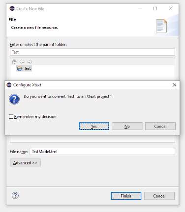
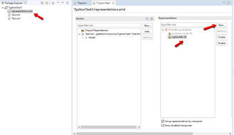

# Typhonml

## TyphonML manuals can be found at the following wiki link:

[Wiki](https://github.com/typhon-project/typhonml/wiki)

or to deliverables:

[Deliverable 2.4](https://github.com/typhon-project/internal-material/tree/master/WP2/D2.4)

## List of functions and features:

- TyphonML enables the specification of data entities and relationships that will be stored in different and heterogeneous databases.
- TyphonML enables the specification of data models by means of both textual and graphical syntaxes.
- Facilities for generating OpenAPI specification from data models specified in TyphonML is provided.
- Specification of data types that are needed for applying text-specific analysis is supported.
- The specification of functional and non-functional requirements that will instruct the
deployment and querying of the modelled data models are supported.
- TyphonML supporting tools detect inconsistent data models (e.g. data entities in relational databases that refer to inexistent collections in document-based data models).
- TyphonML supporting tools provide modellers with early feedback about the specified data models (i.e. deployment feasibility of the modelled data with respect to the actual resource availabilities).

## How to instal TyphonML Eclipse plugin

### Eclipse Installer
The official Eclipse installer may be used to create a fresh Eclipse IDE installation. TyphonML plugin must be manually installed as described in this section. The benefit of this option is that plugin updates are automatically detected and easily applied, without the need to reinstall a new standalone distribution. 
To download the installer visit the official download site [here](https://www.eclipse.org/downloads/).
**It is recommended to use the installer of Eclipse IDE for DSL developers**, that already includes Xtext and EMF can be downloaded from [here](https://www.eclipse.org/downloads/packages/release/2019-06/r/eclipse-ide-java-and-dsl-developers).

If there is already an active Eclipse installation, Typhon plugins may be installed through their corresponding Eclipse Update Site.

### How to install Typhon plugin
The next step is to install all the plugins required to start Typhon Development, through the Install New Software option:

The TyphonML plugin can be installed by the following update/composite site [https://typhon.swat.engineering/composite/](https://typhon.swat.engineering/composite/).

## TyphonML Usage
The following section describes the usage of the TyphonML. It is assumed that user has already downloaded and installed the various tools and plugins needed as described in the previous section.
### Design
To start developing for Typhon, open the Eclipse IDE and Create a new project:

Select Project under General wizard category and aproject will be created.

Create a new Typhon ML file, give it a name and add the .tml extension.

After clicking Finish, you will be prompted to convert the file into an Xtext file. You will need to click YES.

### Simple usage
A very simple model, consisting of two classes, will be used for the rest of this Quick Start Guide. There is a Product class with id and name properties that has a zero to many relationship with the Review class. A relational database stores product records and a document database stores the reviews.
To create this model, edit the contents of the .tml file you have just created and enter the following code:

To transform this ML code into a model, right click on the .tml file, and select Typhon -> Inject to model. This will generate a visual representation of the model classes and their relationships, creating  an xmi file containing model data.

To visually inspect the model, open the generated representations.aird file, select typhonML as representation and click **New…**

The visual model representation should look like this:

At this point, the class design has finished and you may proceed to create the Typhon DL model. To do so, right click on the generated .xmi file and select **TyphonDL -> Create Typhon DL Model**.

## TYPHON MODELLING LANGUAGE
To start a TyphonML model specification, we need to create a new modelling project within a .tml file. The TyphonML editor supports the modeler with the following facilities:

- Syntax Highlighting,
- Background Validation,
- Error Markers,
- Content Assist,
- Hyperlinking, and
- Quick fixes.

In the rest of this section we describe each part of the TyphonML language. In particular, the TyphonML specification consists of 4 main blocks as depicted in the following Figure:

- Custom data types,
- Entities,
- Databases and
- Change operators.

### Custom data type
Custom data types allow the modeler to define their data types. 
It extends the abstract DataType metaclass in order to enable the specification of custom data types. To this end, each CustomDataType instance consists of different elements, which overall contribute the definition of the new data type being defined. For instance, in order to represent geographical points of interest, users can define an address type consisting of four DataTypeItem elements, i.e., street, city, location, and zipcode. Such data items would be of primitive types (e.g., string) or custom data types (e.g., zip). A custom data type consists of primitive and custom type elements as depicted in the following figure where address includes of 3 primitive types, i.e., street, city, and location, and the zipcode custom datatype. Each element is represented by the name, colons and type.

### Entity
The conceptual entities have a name and consist of attributes and relations. Attribute It is a named element, which is defined in terms of the type of elements to be represented. The type structural feature is typed *DataType* and consequently it can be a primitive, custom, or even entity type. 
The attributes are defined by the name, colons and type that can be primitive or custom data types.  We report the complete list of primitive data types in the following:

- *int*,
- *bigint*,
- *string*: this datatype allows to specify the strin max size as parameter (see line 21),
- *text*,
- *point*,
- *polygon*,
- *bool*,
- *float*,
- *blob*,
- *date*,
- *datetime*, and
- *text*: this primitive data type can be decorated with NLP tasks (see line 22 of Figure 23). The complete list of NLP tasks is reported in the following:
	- *ParagraphSegmentation*,
	- *SentenceSegmentation*,
	- *Tokenisation*, 
	- *PhraseExtractor*,
	- *NGramExtractor*,
	- *POSTagging*,
	- *Lemmatisation*,
	- *Stemming*,
	- *DependencyParsing*,
	- *Chunking*,
	- *SentimentAnalysis*,
	- *TextClassification*,
	- *TopicModelling*,
	- *TermExtraction*,
	- *NamedEntityRecognition*,
	- *RelationExtraction*, and
	- 	ì*CoreferenceResolution*.

Relation is a named element, which permits to specify relationships between different entities. In particular, the structural features of such modeling constructs are the following:

- type: it permits to define the type of the relationship being specified;
- cardinality: entities can be involved in relationships of different cardinalities, which can be singular or multiple;
- opposite: when creating a reference from one entity (e.g., named e1) to a second entity (e.g., named e2) it is possible to specify the opposite reference from e2 to e1 in order to define a bidirectional relation instead of two different unidirectional ones.
- isContainment: it is a boolean attribute, which permits to specify if the target entity is contained (e.g., to trigger cascade-deletion) or not in the entity being modeled.

The relations are represented by the name, the keyword ->, the linked entity, and the cardinality, which can be either _0..1_, _1_, _0..*_, and _*_ (see line 27 of the next picture). A containment relation is represented as colons before the -> keyword (see line 28 of the next picture), whereas a bidirectional relation is defined with its opposite relation see (line 26 of the next picture). Containment and bidirectional relations can occur together as shown in line 30 of the following picture.

### Databases
Currently, TyphonML supports four kinds of database systems, i.e., relational DB, graph DB, documental DB, and kay-value DB. We report the syntax of each supported DB system in the following.
The followibng figure depicts an instance of relational DB. It consists of a name (line 70) and tables (lines 71-80). A table maps a conceptual entity (line 73) and allows to specify indexes (lines 74-76) and ids (line 79). The editor accepts and suggests only attributes specified in the mapped entity (line 75) as possible indexes ones or id (line 77). 

The following picture depicts an instance of documental DB that consists of a name (line 87) and a list of collections (lines 88-92), where each one maps a conceptual entity (line 89).

An instance of Graph DB specification is depicted in lines 70-82 of the next figure, where two entities i.e., Wish and Concordance, are mapped as graph edges. It worth noting that only entities with more than two one-to-one relations can be used as edge, and only a one-to-one relationship can be used as a source or a target. In this way, the editor can detect possible edge mapping errors. For instance, lines 73-76 notify an error because the edge points to the Wish entity that consists of a single one-to-one relation.

The next figure depicts an instance of Key-value DB that consists of a name (line 82) and a list of elements (lines 88-92), where each one represents a key-value structure. Each element consists of a name (User in line 84), the key name (userKey) and a list of entities’ attributes (User.photoURL and User.avatarURL) that the key-value structure maps.

###Change operator
This section presents the syntax of change operators to support the evolution workpackage. A change operator can be applied on entities, relations, attributes, databases and custom data types. We recap all the operators in the following. Moreover,the following image depicts all the change operators at work.

Within entity we can apply the following change operators:

- Rename Entity (line 124),  
- Remove Entity (line 125),  
- Split Entity Vertical (line 126),  
- Split Entity Horizontal (line 127),  
- Migrate Entity (line 128),   
- Merge Entity (lines 129), and
- Add Entity (lines 130-137).

Within entity we can apply the following change operators:

- Add Relation (line 140),
- Rename Relation (line 141)
- Remove Relation (line 142),  
- Enable Relation Containment (line 143),  
- Disable Relation Containment (line 144), and  
- Change Relation Cardinality (line 145).

Within attribute we can apply the following change operators:

- Add Custom Data Type Attribute (line 148),  
- Add Primitive Data Type Attribute (line 149),
- Remove Attribute (line 150),
- Rename Attribute (line 151),
- Change Primitive Data Type Attribute (line 152), and 
- Change Custom Data Type Attribute (line 153).

Within database elements we can apply the following change operators:

- Rename Table (line 156),
- Add Index (line 157),
- Drop Index (line 158),  
- Add Attributes to Index (line 159),  
- Remove Attributes to Index (line 160),  
- Rename Collection (line 161),  
- Add Collection Index (line 162), and  
- Drop Collection Index (line 163).

Finally we provide a construct to add Custom Data Type (line 166).

## Graphical editor
The TyphonML graphical editor has been developed by means of Sirius . Sirius is an Eclipse project that enables the development of graphical modeling environments by leveraging well-established technologies. Starting from a metamodel, it allows a model-based specification of visual concrete syntax organized in viewpoints(pointed with3), i.e., models that can be authored by means of different notations that suit the needs of various stakeholders. The next figure depicts an instance of TyphonML model defined by the graphical editor. The palette, in the right , allows the modeler to add the TyphonML elements to the canvas in the left part.
Previously, we described how to open a TyphonML models by the graphical editor. Thanks to the Sirius and Xtext  integration, graphical and textual editors are both synchronized. In this way, stakeholders with different skills can define TyphonML models using different syntaxes.

## Generation of the OpenAPI specification
In this section, we describe how the OpenAPI  specification is generated from the   TyphonML model. In particular, it is a specification for describing, consuming, and visualizing RESTful web   services which allows both humans and machines to discover and understand the provided services. An OpenAPI definition can be used for many purposes, e.g., documentation, generation of clients in various programming languages, displaying APIs as a web UI, testing, and many other use cases. Once the TyphonML specification is completed, a synthesis tool is applied to generate the corresponding OpenAPI specification by a set of coordinated Acceleo-based model-to-code transformations .
The contextual menu (see the next figure) allows the modeler to produce the OpenAPI specification of a given TyphonML model. Then, she can use it to directly generate clients in various programming languages that programmatically interact with the polystore resources. 

In the next figure, we report an excerpt of the OpenAPI specification generated from a simple eCommerce TyphonML model.

## Current development status

- Definition of custom data types to be used in TyphonML data models.
- Integration with DL
- Integration with QL

## List of future functions and features we are going to implement.

- Integration with DL. It is necessary to have from them the information regarding the databases that they are able to manage in order, therefore, to design the consistent TyphonML instance.
- Integration with QL. Integration with them is required as we do the generation of microservices at the moment, but it is necessary for the QL to have control over the APIs generated.
